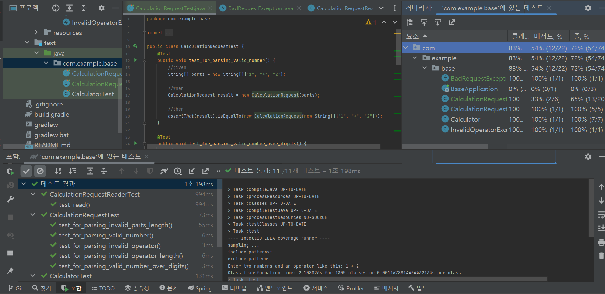

# spring-base

## 테스트 필요성
Legacy 코드란 뭘까? 시간과 상관없이 테스트가 없는 코드

테스트의 목적
1. regression 버그 방지: 잘 돌아가던 코드가 이번 배포에는 안 돼요 ㅠㅠ 방지
2. 좋은 아키텍처를 유도
-> 좋은 테스트를 하다보면, SOLID 원칙을 지키게 됨

## 테스트 3분류
**LARGE** (5%): 멀티 서버 
**MEDIUM** (15%): 단일 서버, 멀티 프로세스, 멀티 스레드 
  H2를 이용하는 순간, MEDIUM 테스트 레벨이 되기 때문에 지양해야 함 
**SMALL (80%): 단일 서버, 단일 프로세스 및 스레드, blocking call 없음**

SMALL 수준의 테스트 코드를 작성하는 게 중요함!!

## 테스트 개념
- SUT: System under test (테스트 하려는 대상)
- BDD: Behaviour driven development (**given-when-then**), 유저가 시스템을 사용하는 user story를 강조하고 시나리오를 강조함
- 상태 검증: 결과 자체만 보고 비교
- 행위 검증: 테스트에 넣었을 때, 협력 객체의 어떤 메서드를 실행하는가?
- 테스트 픽스처: 테스트에 필요한 자원을 생성하는 것 (가급적 지양)
  ex. User 객체를 미리 할당 @BeforeEach
- 비욘세 규칙: 유지하고 싶은 상태가 있으면 전부 테스트로 작성 -> 그게 곧 정책이 됨
  ex. 유저 아이디는 이메일이라는 정책 -> 이메일이 아니라면, 예외를 던지는 테스트를 작성
- Test double: 테스트 대역
  ex. 회원가입에 이메일 발송이 필요 -> 이메일을 발송하는 대역

## 대역
- **dummy**: 아무런 동작도 하지 않고, 그저 코드가 정상적으로 돌아가기 위해 전달하는 객
- **fake**: Local에서 사용하거나 테스트에서 사용하기 위해 만들어진 가짜 객체, 자체적인 로직이 있다는 게 특징
- **stub**: 미리 준비된 값을 출력하는 객체, mockito 프레임워크를 이용
- **mock**: 메서드 호출을 확인하기 위한 객체
- **spy**: 메서드 호출을 전부 기록했다가 나중에 확인하기 위한 객

## 테스트 코드
**커버리지 측정  **

테스트 패키지 우클릭 > 그 외 실행/디버그 > 커버리지로 실행 클릭

